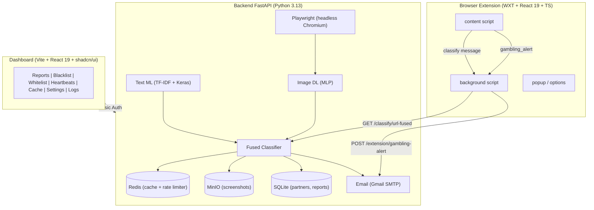

# Gambling Blocker

A **Machine Learning**-based real-time gambling website detection and blocking system with an **accountability partner** mechanism to prevent users from disabling protection.

## Architecture



## Components

| Component | Directory | Stack |
|-----------|-----------|-------|
| **Backend** | `backend/` | Python 3.13, FastAPI, TensorFlow, scikit-learn, Redis, MinIO, Playwright |
| **Extension** | `client/gambling-extension/` | WXT, React 19, TypeScript, Tailwind v4 |
| **Dashboard** | `client/dashboard/` | Vite 8, React 19, TypeScript, shadcn/ui, TanStack Query |

## Quick Start

```bash
# 1. Clone & enter directory
git clone <repo-url> && cd gambling-blocker

# 2. Setup backend
cd backend
cp .env.example .env
# Edit .env — fill in SMTP credentials (Gmail App Password)
docker compose up -d          # Redis + MinIO
uv sync
uv run playwright install chromium
uv run fastapi dev            # http://localhost:8000

# 3. Setup extension
cd client/gambling-extension
pnpm install
pnpm dev                      # http://localhost:3000

# 4. Setup dashboard
cd client/dashboard
pnpm install
pnpm dev                      # http://localhost:5173
```

> See [docs/setup.md](docs/setup.md) for a complete guide.

## Documentation

| File | Content |
|------|---------|
| [docs/architecture.md](docs/architecture.md) | System architecture and workflows |
| [docs/setup.md](docs/setup.md) | Complete installation guide |
| [docs/api.md](docs/api.md) | API endpoint documentation |
| [backend/README.md](backend/README.md) | Backend documentation *(Bahasa Indonesia)* |
| [client/gambling-extension/README.md](client/gambling-extension/README.md) | Extension documentation *(Bahasa Indonesia)* |
| [client/dashboard/README.md](client/dashboard/README.md) | Dashboard documentation *(Bahasa Indonesia)* |
| [README.md](README.md) | Versi Bahasa Indonesia |
