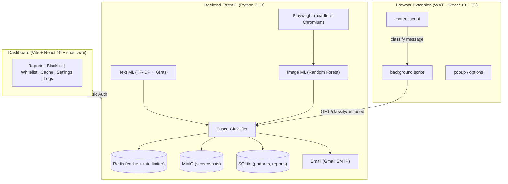

# Gambling Blocker

Sistem deteksi dan pemblokiran situs judi *real-time* berbasis **Machine Learning** dengan sistem *accountability partner* untuk mencegah pengguna mematikan proteksi.

## Arsitektur



## Komponen

| Komponen | Direktori | Stack |
|----------|-----------|-------|
| **Backend** | `backend/` | Python 3.13, FastAPI, TensorFlow, scikit-learn, Redis, MinIO, Playwright |
| **Extension** | `client/gambling-extension/` | WXT, React 19, TypeScript, Tailwind v4 |
| **Dashboard** | `client/dashboard/` | Vite 8, React 19, TypeScript, shadcn/ui, TanStack Query |

## Mulai Cepat

```bash
# 1. Clone & masuk direktori
git clone <repo-url> && cd gambling-blocker

# 2. Setup backend
cd backend
cp .env.example .env
# Edit .env — isi SMTP credentials (Gmail App Password)
docker compose up -d          # Redis + MinIO
uv sync
uv run playwright install chromium
uv run fastapi dev            # http://localhost:8000

# 3. Setup extension
cd client/gambling-extension
pnpm install
pnpm dev                      # http://localhost:3000

# 4. Setup dashboard
cd client/dashboard
pnpm install
pnpm dev                      # http://localhost:5173
```

> Lihat [docs/setup.md](docs/setup.md) untuk panduan lengkap.

## Dokumentasi

| File | Isi |
|------|-----|
| [docs/architecture.md](docs/architecture.md) | Arsitektur sistem dan alur kerja |
| [docs/setup.md](docs/setup.md) | Panduan instalasi lengkap |
| [docs/api.md](docs/api.md) | Dokumentasi API endpoint |
| [backend/README.md](backend/README.md) | Dokumentasi backend |
| [client/gambling-extension/README.md](client/gambling-extension/README.md) | Dokumentasi ekstensi browser |
| [client/dashboard/README.md](client/dashboard/README.md) | Dokumentasi dashboard |
| [README.en.md](README.en.md) | English version |
