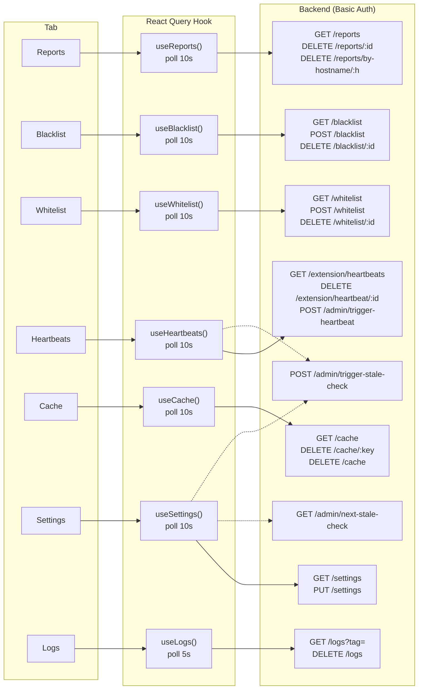
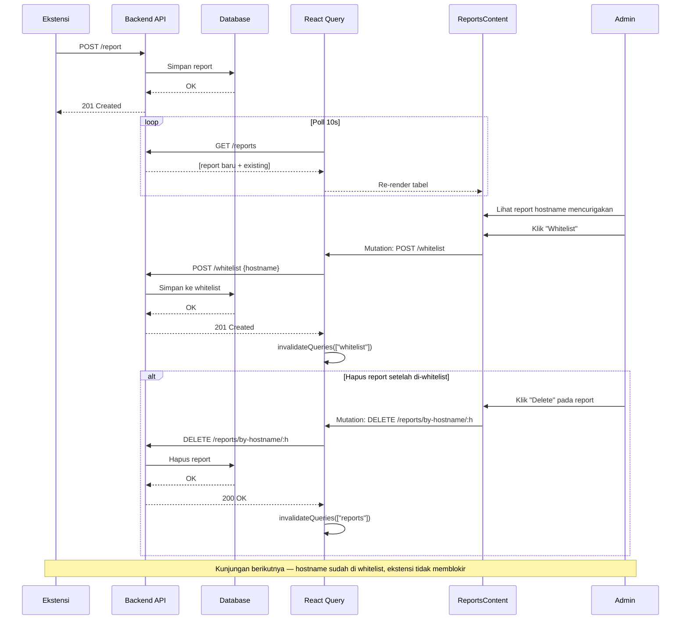
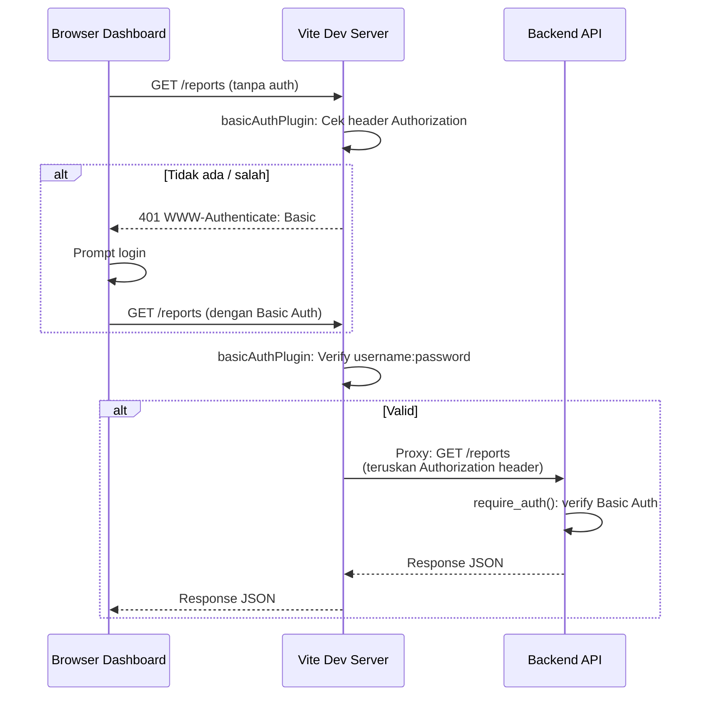

# Gambling Blocker — Dashboard

Admin dashboard untuk memonitor dan mengkonfigurasi sistem Gambling Blocker. Dibangun dengan React 19, Vite 8, dan shadcn/ui.

## Tech Stack

| Komponen | Teknologi |
|----------|-----------|
| Framework | React 19.2 |
| Build tool | Vite 8 |
| Bahasa | TypeScript (strict) |
| UI Library | shadcn/ui (Radix-Nova style) |
| Icons | Lucide React |
| Styling | Tailwind CSS v4 |
| Data fetching | TanStack React Query v5 |
| Date picker | react-day-picker v9 + date-fns v4 |
| Notifikasi | sonner v2 |
| Font | Geist Variable |
| Linter | ESLint v10 |

## Struktur Direktori

```
src/
├── main.tsx                   # Entry point
├── App.tsx                    # Root dengan tab navigasi
├── index.css                  # Global styles, Tailwind, CSS variables tema
├── components/
│   ├── ui/                    # 16 shadcn/ui primitives (button, card, tabs, dll)
│   ├── theme-provider.tsx     # Provider tema (light/dark/system)
│   ├── LanguageSwitcher.tsx   # Toggle bahasa EN/ID
│   ├── ThemeSwitcher.tsx      # Toggle tema
│   ├── SettingsPanel.tsx      # Tab Settings
│   ├── PartnerPanel.tsx       # Kartu status partner
│   ├── HeartbeatsPanel.tsx    # Tabel status heartbeat semua partner
│   ├── TriggerStaleCheckButton.tsx  # Tombol trigger + countdown stale check
│   ├── SummaryCards.tsx       # Kartu statistik reports
│   ├── ReportsTable.tsx       # Tabel laporan false positive
│   ├── ReportsContent.tsx     # Gabungan SummaryCards + ReportsTable
│   ├── BlacklistPanel.tsx     # Manajemen blacklist
│   ├── WhitelistPanel.tsx     # Manajemen whitelist
│   ├── CachePanel.tsx         # Browser cache Redis
│   ├── LogsPanel.tsx          # Viewer log real-time
│   └── datetime-picker.tsx    # Picker tanggal reusable
├── hooks/
│   ├── useAdmin.ts            # POST /admin/trigger-stale-check, GET /admin/next-stale-check
├── useDateLocale.ts       # Map dashboard locale → date-fns locale
│   ├── useHeartbeats.ts       # GET /extension/heartbeats, DELETE, POST /admin/trigger-heartbeat
│   ├── useSettings.ts         # GET/PUT /settings
│   ├── useExtensions.ts       # GET /extension/status
│   ├── useReports.ts          # GET/DELETE /reports
│   ├── useLogs.ts             # GET/DELETE /logs
│   ├── useCache.ts            # GET/DELETE /cache
│   └── useLists.ts            # CRUD /blacklist & /whitelist
├── i18n/
│   ├── context.tsx            # I18nProvider + useI18n hook
│   ├── en.ts                  # 150+ kunci terjemahan Inggris
│   └── id.ts                  # 150+ kunci terjemahan Indonesia
├── lib/
│   ├── query.tsx              # QueryClient + QueryProvider
│   └── utils.ts               # cn() utility (clsx + tailwind-merge)
└── utils/
    └── url.ts                 # hostnameFromUrl()
```

## Halaman / Tab

| Tab | Komponen | Deskripsi |
|-----|----------|-----------|
| **Reports** | `ReportsContent` | Laporan false positive per hostname, cari, aksi whitelist/blacklist/hapus |
| **Blacklist** | `BlacklistPanel` | Tambah/hapus/cari hostname di blacklist |
| **Whitelist** | `WhitelistPanel` | Tambah/hapus/cari hostname di whitelist |
| **Heartbeats** | `HeartbeatsPanel` | Tabel status heartbeat semua partner, trigger manual, hapus riwayat |
| **Cache** | `CachePanel` | Lihat cache Redis, filter, preview screenshot, hapus/flush |
| **Settings** | `SettingsPanel` | Toggle fitur, slider TTL/stale/interval, trigger stale check, bahasa, tema |
| **Logs** | `LogsPanel` | Log backend real-time, filter tag, auto-scroll |

### Fitur Settings

| Bagian | Pengaturan |
|--------|-----------|
| **Features** | Skip screenshot (bypass teks), Multipage inference, Debug logging, Auto Heartbeat on Setup |
| **Cache** | Cache TTL (1–24 jam) |
| **Monitoring** | Stale threshold (1–12 jam), Check interval (5–120 menit), Trigger Stale Check Now |
| **Preferences** | Bahasa (EN/ID), Tema (Light/Dark/System) |

### Aliran Data Dashboard



> **Catatan:** Dotted line menunjukkan hubungan tidak langsung — `POST /admin/trigger-stale-check` dan `GET /admin/next-stale-check` digunakan oleh `TriggerStaleCheckButton` yang dirender di Settings & Heartbeats tab.

### Alur Report Handling



## Data Fetching

Semua data fetching menggunakan **TanStack React Query v5** dengan polling otomatis:

| Hook | Endpoint | Polling | Mutation |
|------|----------|---------|----------|
| `useHeartbeats()` | `GET /extension/heartbeats` | 10s | — |
| `useDeleteHeartbeats()` | `DELETE /extension/heartbeat/:id` | — | Hapus heartbeat |
| `useTriggerHeartbeat()` | `POST /admin/trigger-heartbeat` | — | Trigger manual heartbeat |
| `useSettings()` | `GET /settings` | 10s | `PUT /settings` |
| `useExtensionStatus(id)` | `GET /extension/status` | 30s | — |
| `useReports()` | `GET /reports` | 10s | `DELETE /reports/:id`, `DELETE /reports/by-hostname/:h` |
| `useLogs(tag?)` | `GET /logs?tag=` | 5s | `DELETE /logs` |
| `useCache()` | `GET /cache` | 10s | `DELETE /cache/:key`, `DELETE /cache` |
| `useBlacklist()` | `GET /blacklist` | 10s | `POST /blacklist`, `DELETE /blacklist/:id` |
| `useWhitelist()` | `GET /whitelist` | 10s | `POST /whitelist`, `DELETE /whitelist/:id` |
| `useNextStaleCheck()` | `GET /admin/next-stale-check` | 10s | Countdown jadwal stale check berikutnya |
| `useTriggerStaleCheck()` | `POST /admin/trigger-stale-check` | — | Trigger manual stale check |

Mutation sukses → invalidate query terkait → UI ter-update otomatis.

**Global React Query defaults** (di `src/lib/query.tsx`): `refetchInterval: 10s`, `staleTime: 5s`, `retry: 1`.

## i18n — Internasionalisasi

Implementasi custom via React context + `localStorage`:

- **Provider**: `I18nProvider` di `main.tsx`
- **Hook**: `useI18n()` → `{ locale, setLocale, t(key, params?) }`
- **Template string**: `"stale_threshold_desc": "Kirim alert jika heartbeat > {hours}h"`
- **Persistence**: `localStorage` key `dashboard_lang`

### Cara pakai:

```tsx
import { useI18n } from "@/i18n/context"

function Component() {
  const { t, locale, setLocale } = useI18n()
  return <h1>{t("settings_title")}</h1>
}
```

## Tema

Tiga mode: **Light**, **Dark**, **System** (ikuti preferensi OS).

- Provider custom `ThemeProvider` di `components/theme-provider.tsx`
- Persistence: `localStorage` key `theme`
- Shortcut keyboard: tekan `D` (tidak di input field)
- Sinkronisasi antar tab via `StorageEvent`
- CSS variables `oklch()` di `index.css`

## Proxy Development

`vite.config.ts` mengatur proxy ke backend:

```ts
server: {
  proxy: {
    "/reports":  "http://127.0.0.1:8000",
    "/blacklist": "http://127.0.0.1:8000",
    "/whitelist": "http://127.0.0.1:8000",
    "/cache":    "http://127.0.0.1:8000",
    "/settings": "http://127.0.0.1:8000",
    "/logs":     "http://127.0.0.1:8000",
    "/report":   "http://127.0.0.1:8000",
    "/classify": "http://127.0.0.1:8000",
    "/extension": { target: "http://127.0.0.1:8000", ...authProxy() },
    "/admin":    { target: "http://127.0.0.1:8000", ...authProxy() },
  },
}
```

Auth header diteruskan untuk endpoint yang dilindungi Basic Auth.

### Alur Autentikasi & Proxy



## Perintah Development

| Perintah | Deskripsi |
|----------|-----------|
| `pnpm dev` | Start dev server (port 5173) |
| `pnpm build` | Type-check + Vite build |
| `pnpm lint` | ESLint |
| `pnpm format` | Prettier format |
| `pnpm typecheck` | TypeScript type-check |

## Environment Variables

| Variabel | Default | Deskripsi |
|----------|---------|-----------|
| `VITE_API_BASE` | (kosong) | Base URL backend (kosong = proxy di dev) |
| `DASHBOARD_USERNAME` | `admin` | Basic Auth username (dipakai dev server) |
| `DASHBOARD_PASSWORD` | `admin123` | Basic Auth password (dipakai dev server) |
