# Arsitektur Sistem

## Alur Klasifikasi URL

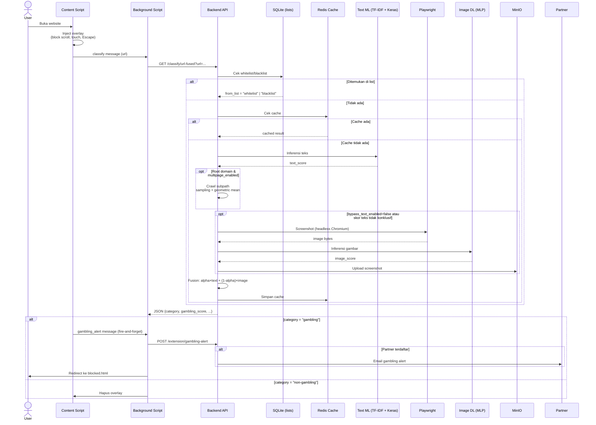

### Fusion Model

Skor akhir = `fusion_alpha * text_score + (1 - fusion_alpha) * image_score`

- `text_score`: Probabilitas dari *neural network* (TF-IDF → Keras) pada URL yang sudah dibersihkan
- `image_score`: Probabilitas dari *Deep Learning (MLP)* + *StandardScaler* pada **69 fitur** gambar:
  - **Patch features (60)**: Mean & std dari 10 acak patch 16×16 pada 3 kanal warna
  - **Edge density (3)**: Rata-rata, std, dan proporsi piksel di atas threshold gradient magnitude (Sobel)
  - **Color variance 4×4 grid (3)**: Std dari rata-rata warna per kanal pada grid 4×4
  - **Colorfulness index (1)**: Metrik Hasler & Süstrunk (rg/yb)
  - **Brightness distribution (2)**: Rasio piksel gelap (V<0.2) dan terang (V>0.8) di HSV
- `fusion_alpha`: Bobot dari `image_fusion_alpha.json`, ditemukan via *grid search* (alpha=0.5, threshold=0.48, F1=0.9798)
- **Bypass teks**: Jika `bypass_text_enabled=true` dan skor teks >= 0.95 atau <= 0.05, gambar dilewati untuk menghemat resource
- **Threshold akhir**: Menggunakan threshold dari fusion config (0.48) untuk semua keputusan kategori

### Multipage Inference

Untuk URL domain root (path kosong atau "/"), sistem melakukan crawling internal jika `multipage_enabled=true`:

1. Fetch halaman root via HTTP (requests)
2. Parse semua `<a href="...">` — filter same-domain + buang ekstensi file (jpg, png, css, js, pdf, dll.)
3. Filter path depth ≥ 2
4. Stratified sampling: max 2 subpath per direktori pertama, total max 8
5. Jika tidak cukup path depth ≥ 2, fallback include depth 1
6. Jalankan inferensi teks pada setiap subpath
7. Agregasi via **geometric mean** — **hanya subpath** (root score sebagai fallback jika fetch/subpath gagal)

### Tahapan Rinci

Berikut adalah penjelasan langkah demi langkah dari alur klasifikasi URL:

#### A. Injection & Overlay (Content Script)

1. Content script berjalan di `document_start` pada semua URL (`*://*/*`)
2. `shouldSkip()`: Lewati jika protocol `chrome-extension://` / `moz-extension://` atau host `127.0.0.1` / `localhost` / `[::1]` / `0.0.0.0`
3. Inject elemen `<style>` + `<div id="gb-overlay">` dengan:
   - Posisi `fixed; inset: 0; z-index: 2147483647`, background putih, spinner animasi
   - Blokir interaksi: `overflow: hidden`, prevent `Escape` (capture), `wheel`, `touchmove`
4. Kirim `browser.runtime.sendMessage({ type: "classify", url })` ke background script

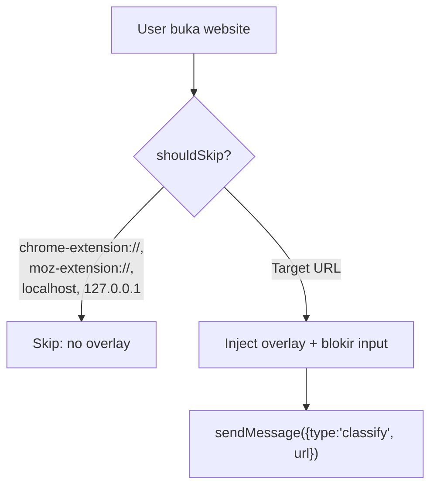

#### B. Messaging ke Background

1. Background script menerima message `"classify"` dari content script
2. Ekstrak URL, panggil `GET /classify/url-fused?url=<encoded>`
3. Respons JSON dikembalikan ke content script via promise

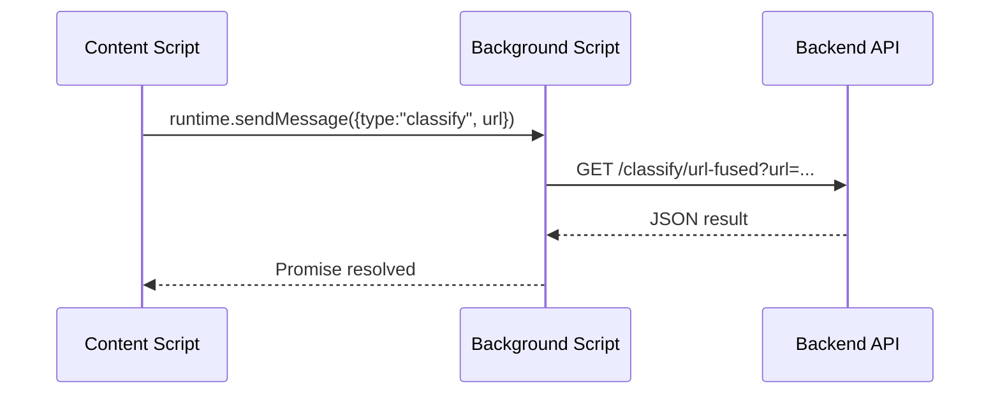

#### C. Rate Limiting

1. Backend membuat key Redis `rate:fused:{hostname}` via atomic increment (`cache_incr`)
2. TTL 60 detik, batas 10 permintaan per menit per hostname
3. Jika rate limit terlampaui: coba ambil dari cache dulu, jika tidak ada → return **429**

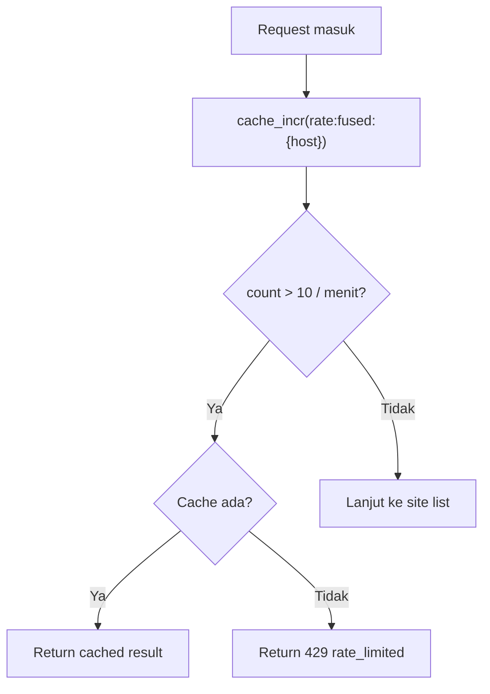

#### D. Pengecekan Site List (SQLite)

1. Query tabel `site_lists` untuk `hostname` yang diminta
2. Jika ditemukan sebagai `"whitelist"`:
   - Return segera: `category: "non-gambling"`, `gambling_score: 0.0`, `from_list: "whitelist"`
3. Jika ditemukan sebagai `"blacklist"`:
   - Return segera: `category: "gambling"`, `gambling_score: 1.0`, `from_list: "blacklist"`
4. Jika tidak ada di list: lanjut ke tahap berikutnya

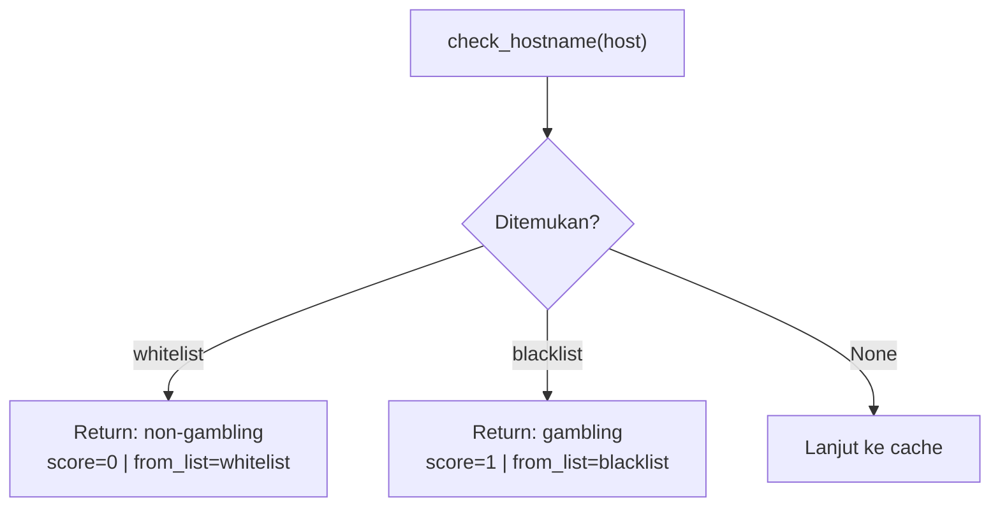

#### E. Cache Lookup (Redis)

1. Key: `fused:domain:{hostname}`
2. Jika cache ada (`cache_get`): return hasil dengan `from_cache: true`, perbarui `screenshot_url` via presigned MinIO URL
3. TTL cache dari settings (default 24 jam, minimal 1 jam)

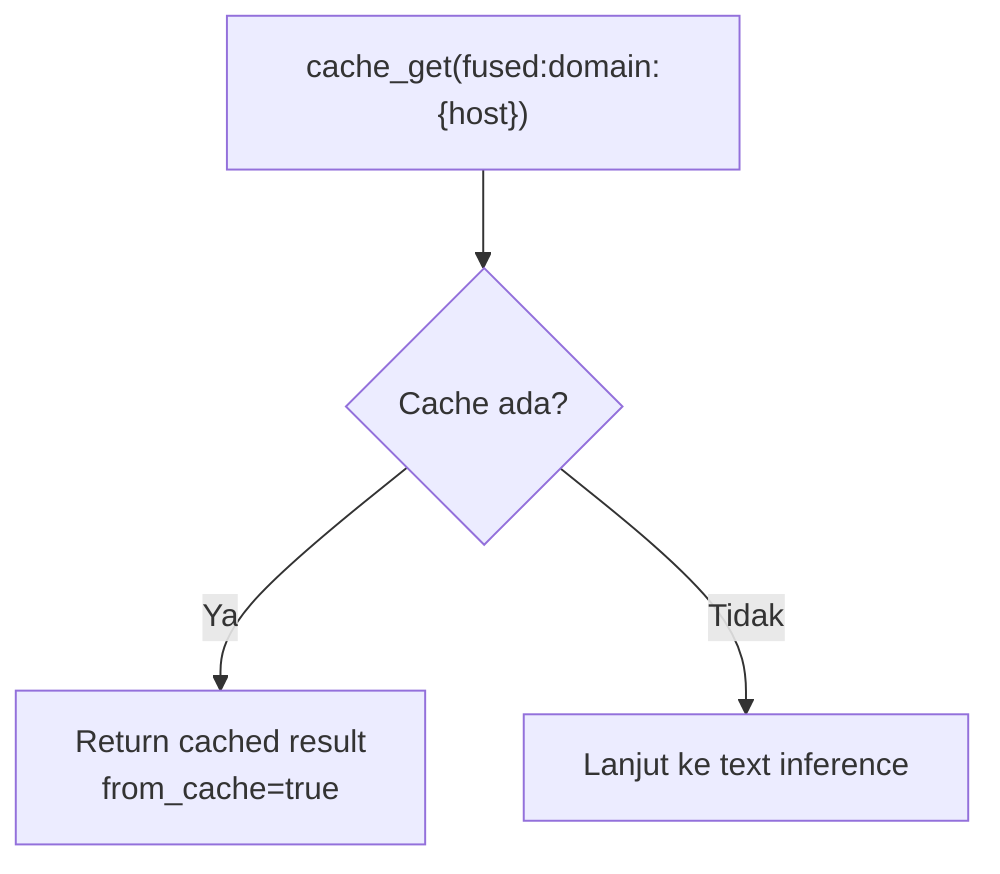

#### F. Text Inference

1. **URL Cleaning** (`clean_url`):
   - Ekstrak `netloc + path` → URL-decode → lowercase
   - Hapus prefix `http://` / `https://`
   - Ganti `-`, `_`, `/` dengan spasi
   - Hapus semua non-alfanumerik/non-spasi
   - Sisipkan spasi antara digit-huruf
   - Collapse spasi ganda
2. **TF-IDF Vectorization**: Transformasi menggunakan `TfidfVectorizer` terlatih dari `text_tfidf_vectorizer.pkl`
3. **Keras Neural Network**: `text_classifier.keras` → output probabilitas sigmoid → `text_score`
4. Threshold teks: 0.66 (dari `text_best_threshold.json`)

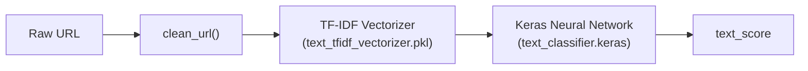

#### G. Multipage Inference (Root Domain)

1. Hanya berjalan jika `multipage_enabled=true` dan path adalah root (`""` atau `"/"`)
2. Detail implementasi ada di sub-section **Multipage Inference** di atas
3. Hasil aggregasi menggantikan `text_score` untuk tahap selanjutnya

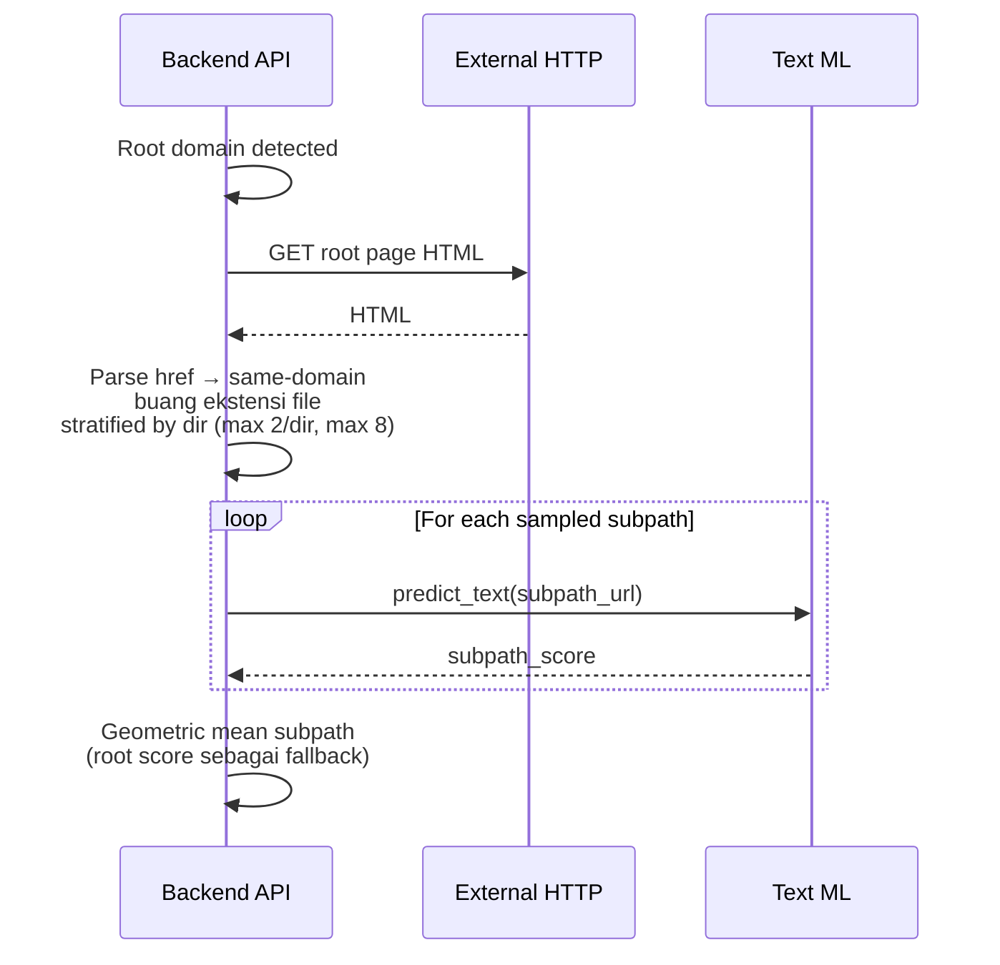

#### H. Screenshot & Image Inference

1. **Bypass logic**: Jika `bypass_text_enabled=true` DAN (`text_score >= 0.95` ATAU `text_score <= 0.05`) → skip screenshot, `screenshot_status: "bypass_text_only"`, `gambling_score = text_score`
2. **Screenshot** (Playwright):
   - Headless Chromium, viewport 1280×720, user-agent Chrome 125, locale `id-ID`, timezone `Asia/Jakarta`
   - Bypass CSP, ignore HTTPS errors
   - Stealth mode (`playwright_stealth`)
   - Timeout 30s navigasi + 15s networkidle
   - Hapus overlay/modal/cookie popup via JavaScript injection
   - Deteksi halaman terblokir (Cloudflare, 403, akses ditolak, dll.) → `screenshot_status: "blocked"`
   - Screenshot ukuran < 1024 bytes → `screenshot_status: "blank_screenshot"`
   - Screenshot > 100KB dianggap noise → `screenshot_status: "noise_screenshot"`
3. **Feature Extraction** (69 fitur):
   - Resize ke 64×64 (LANCZOS), normalize [0,1]
   - **Patch features (60)**: 10 patch acak 16×16 → mean & std per kanal RGB
   - **Edge density (3)**: Gradient magnitude via Sobel → mean/max, std/max, proporsi > threshold
   - **Color variance 4×4 grid (3)**: Std dari rata-rata warna 16 cell per kanal
   - **Colorfulness index (1)**: `sqrt(rg.std² + yb.std²) + 0.3×sqrt(rg.mean² + yb.mean²)` (Hasler & Süstrunk)
   - **Brightness distribution (2)**: Rasio piksel gelap (V<0.2) dan terang (V>0.8) di HSV
4. **Deep Learning Prediction (MLP)**:
   - Fitur di-scale dengan `StandardScaler` dari `image_scaler.pkl`
   - Prediksi probabilitas kelas gambling via model Deep Learning `image_classifier.keras`
   - Output: `image_score` (float 0–1)
5. **Upload**: Screenshot diupload ke MinIO, `screenshot_url` adalah presigned URL (expired 1 jam)

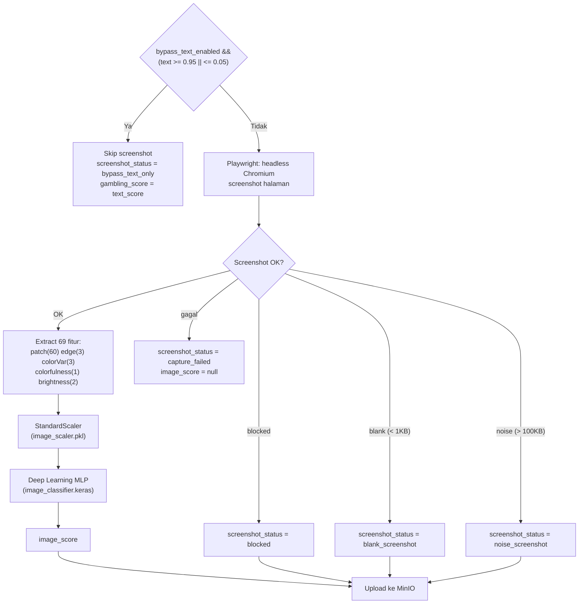

#### I. Fusion, Caching, & Response

1. **Fusion score**:
   ```
   gambling_score = fusion_alpha × text_score + (1 - fusion_alpha) × image_score
   ```
   - `fusion_alpha`: 0.5 (dari `image_fusion_alpha.json`)
   - Jika image tidak tersedia (bypass/gagal): `gambling_score = text_score`
2. **Kategori**:
   - `gambling_score > fusion_threshold (0.48)` → `category: "gambling"`
   - Selainnya → `category: "non-gambling"`
3. **Cache**: Simpan hasil ke Redis key `fused:domain:{hostname}` dengan TTL dari settings
4. **Response ke background script**: JSON lengkap termasuk semua skor, status screenshot, URL screenshot
5. **Tindakan akhir** (di content script):
   - Jika `category: "gambling"`:
     - Kirim `gambling_alert` (fire-and-forget) → background → `POST /extension/gambling-alert` → email partner (jika terdaftar)
     - Kirim `redirect` → background → `browser.tabs.update()` ke `blocked.html?url=...&score=...&from_list=...`
     - Fallback: navigasi langsung via `window.location.href`
    - Jika `category: "non-gambling"`:
      - `cleanup()`: hapus overlay, restore scroll, remove event listeners

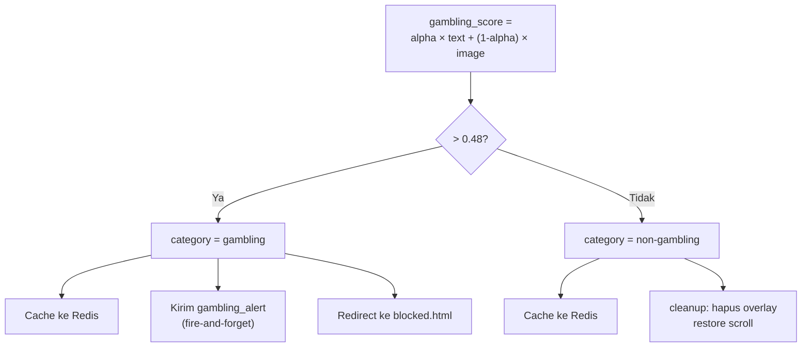

## Sistem Partner Accountability

### Setup

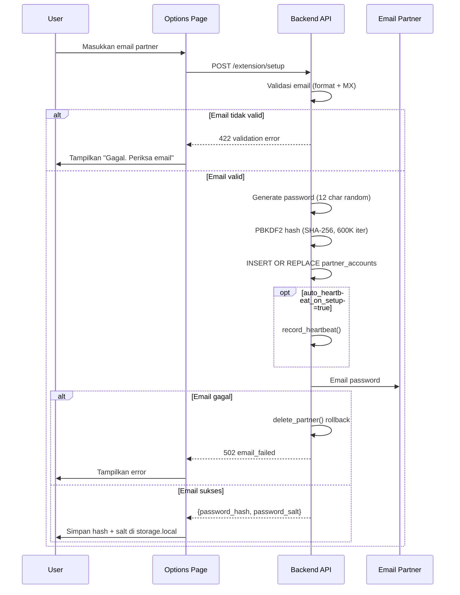

### Password Gate & Bypass

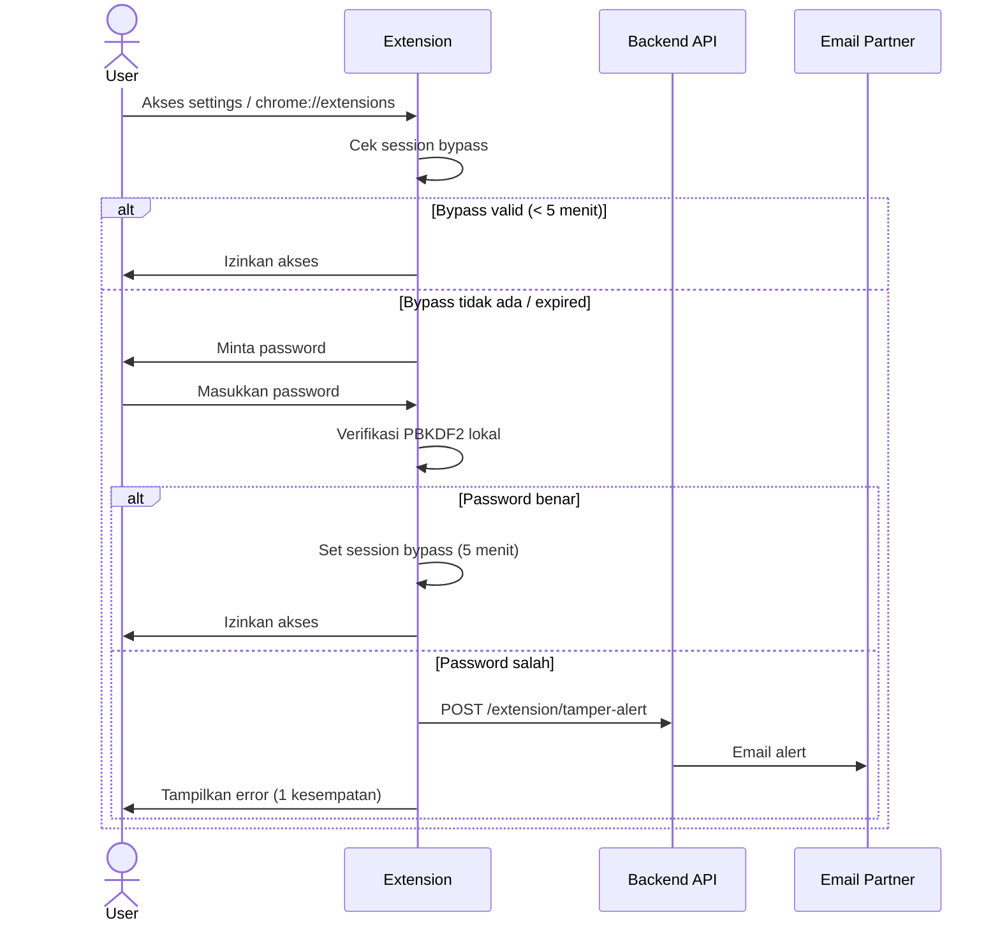

### Reset Password

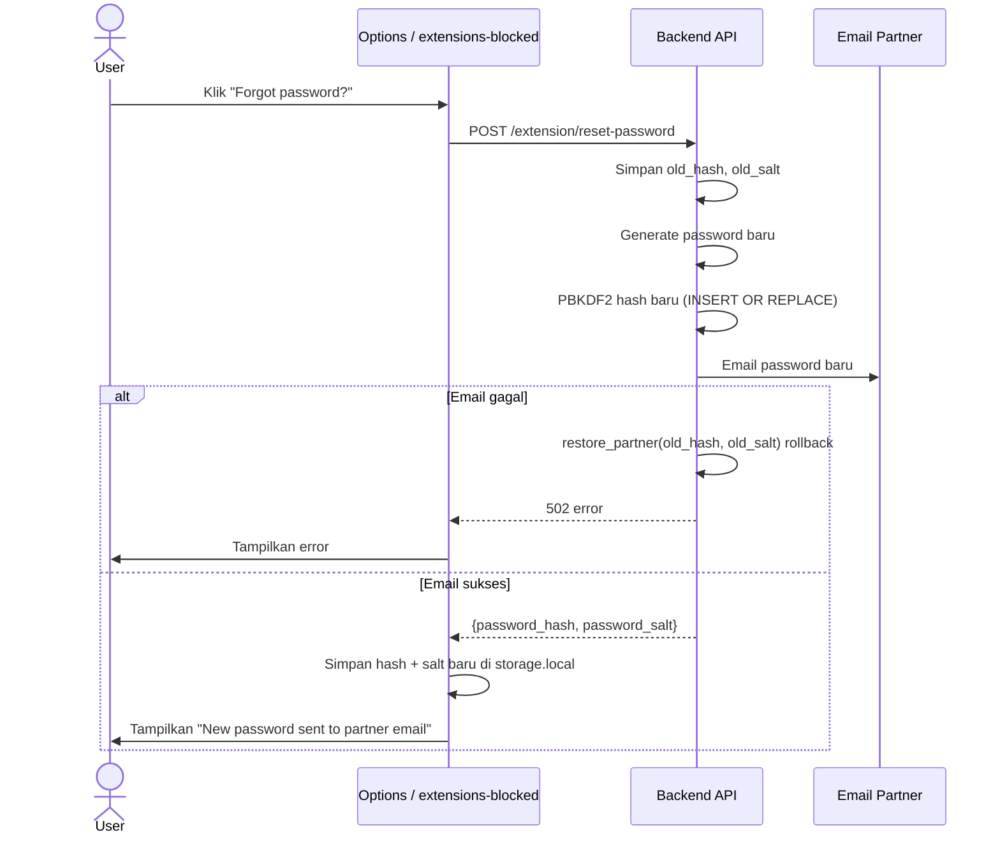

### Heartbeat & Stale Detection

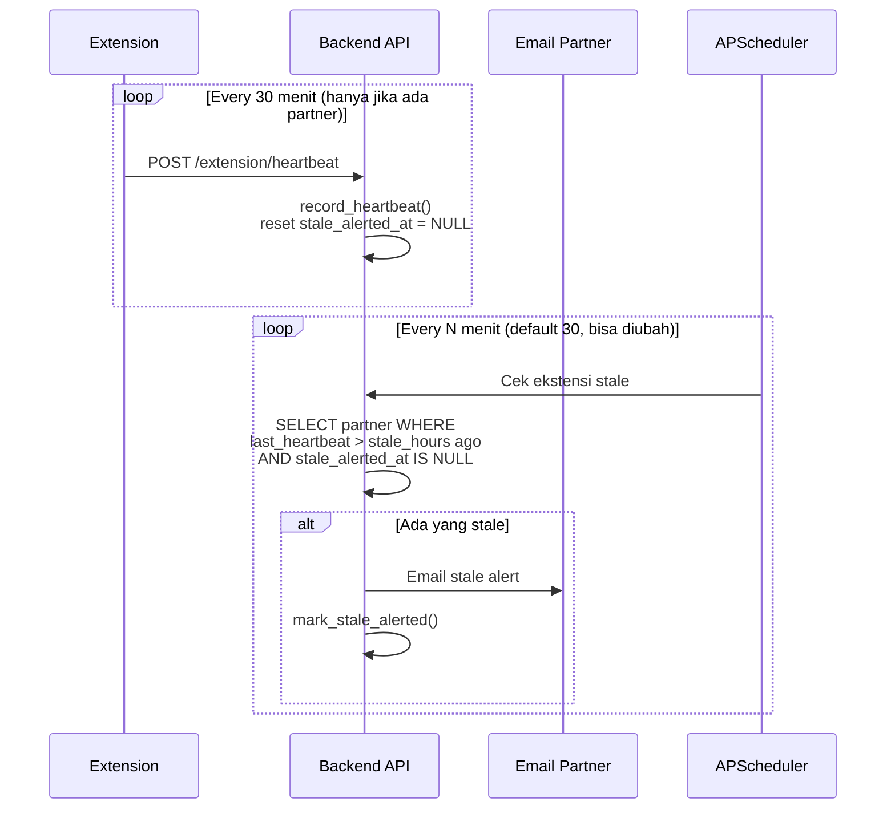

## Multi-Browser Extension Guard

`isExtensionsUrl()` mendeteksi URL manajemen ekstensi:

| Browser | URL |
|---------|-----|
| Chrome | `chrome://extensions` |
| Edge | `edge://extensions` |
| Brave | `brave://extensions` |
| Opera | `opera://extensions` |
| Vivaldi | `vivaldi://extensions` |
| Firefox | `about:addons` |

Dua listener di `background.ts`:
- `tabs.onUpdated` — hanya bereaksi pada `changeInfo.url`
- `tabs.onActivated` — menangkap tab yang sudah ada saat bypass kedaluwarsa

## Grace Period

| Periode | Perilaku |
|---------|----------|
| Hari 0–7 | Grace: notifikasi "Set partner dalam X hari", akses extensions diizinkan |
| Hari 7+ | Warn: notifikasi proteksi terkompromi, akses extensions diizinkan |
| Setelah partner di-set | Block: redirect ke halaman password |

## Database SQLite (`app.db`)

| Tabel | Isi |
|-------|-----|
| `reports` | Laporan false positive (url, score, ip, timestamp) |
| `site_lists` | Blacklist & whitelist (hostname, tipe, timestamp) |
| `partner_accounts` | Partner (extension_id, email, password_hash, salt, stale_alerted_at) |
| `heartbeats` | Riwayat heartbeat (extension_id, timestamp, ip_address) |
| `tamper_logs` | Riwayat tamper (extension_id, event_type, details, timestamp) |

## Komponen Ekstensi

| Entrypoint | Fungsi |
|------------|--------|
| `background.ts` | Service worker: routing message (classify, redirect, **gambling_alert**), guard extensions, heartbeat alarm |
| `content.ts` | Content script: overlay, klasifikasi, redirect, kirim **gambling_alert** ke background jika gambling |
| `blocked/App.tsx` | Halaman blokir: skor, report false positive |
| `extensions-blocked/App.tsx` | Halaman password gate + "Forgot password?" (reset) untuk extensions page |
| `options/App.tsx` | Halaman pengaturan: setup partner, password gate dengan "Forgot password?", ganti bahasa |
| `popup/App.tsx` | Popup: status, breakdown, bypass countdown + Lock Now, report |

## Aliran Data Dashboard

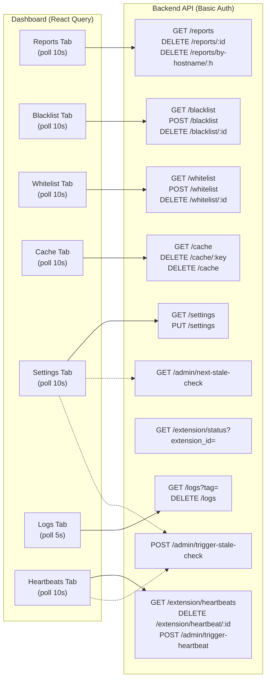

> **Catatan:** `PartnerPanel` (poll 30s via `GET /extension/status?extension_id=`) adalah komponen yang dirancang untuk digunakan di halaman options/popup ekstensi, **bukan** tab dashboard. Komponen ini ada di `src/components/PartnerPanel.tsx` tapi tidak dirender di `App.tsx`.
>
> Endpoint admin `POST /admin/trigger-stale-check` dan `GET /admin/next-stale-check` digunakan oleh `TriggerStaleCheckButton` di Settings & Heartbeats tab.
