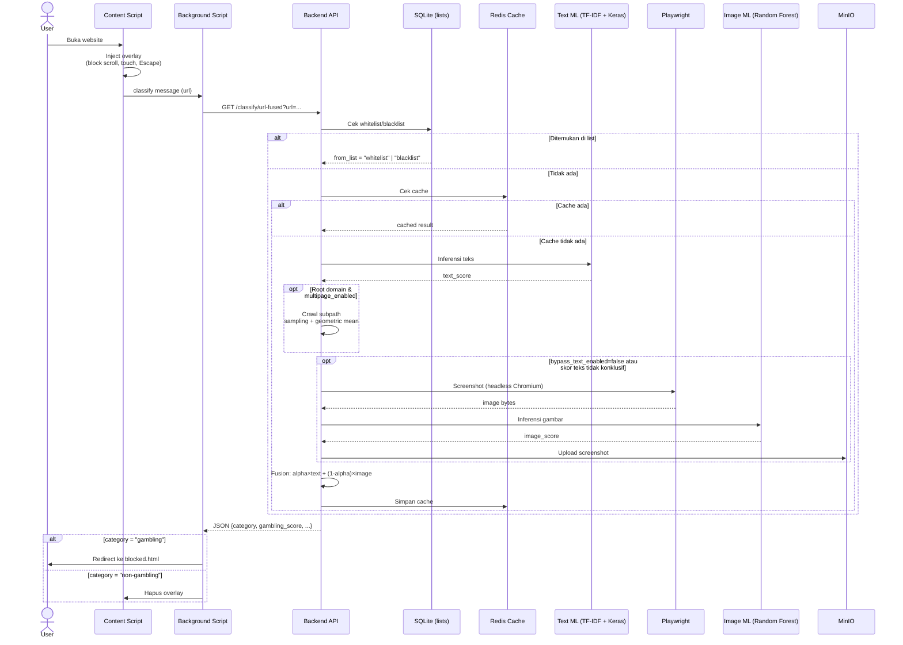
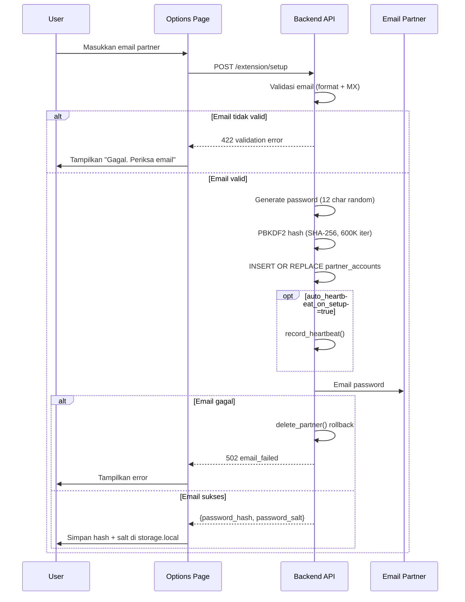
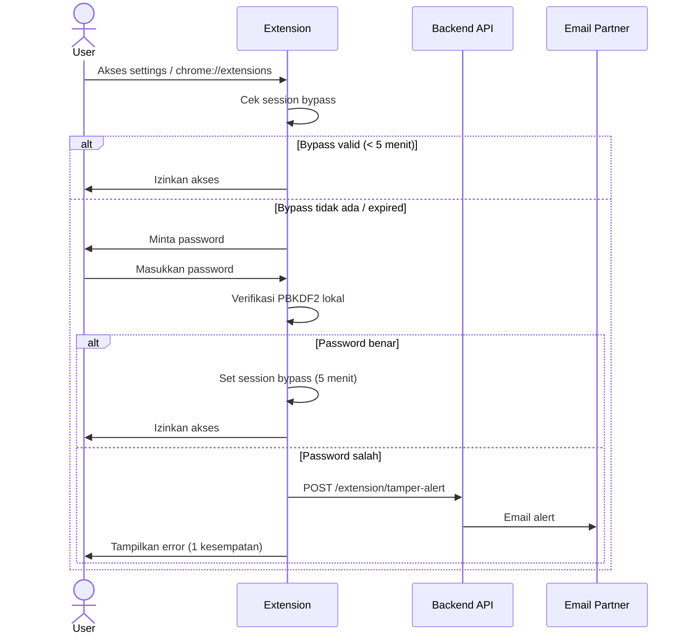
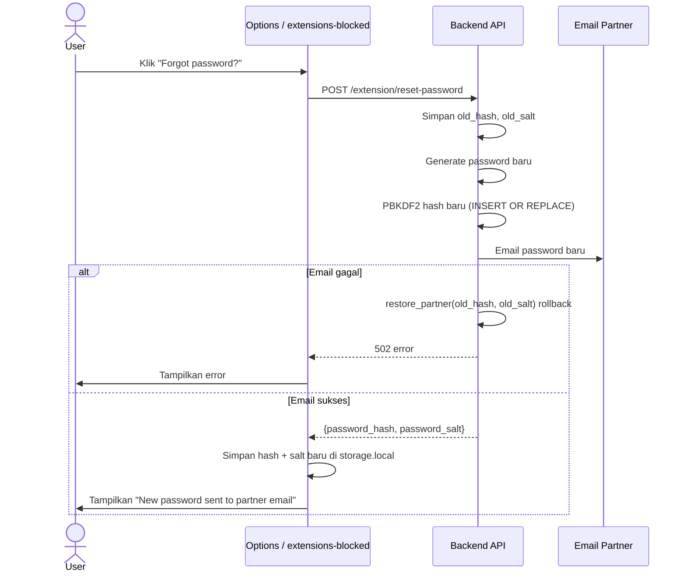
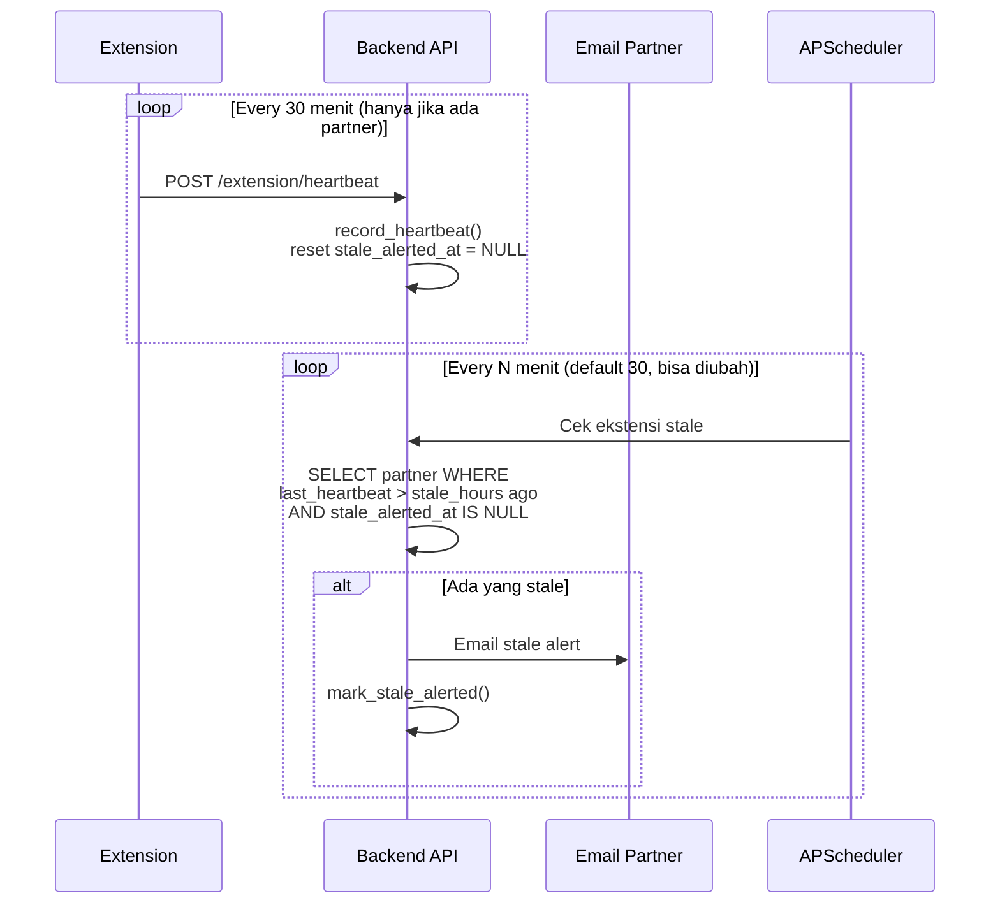
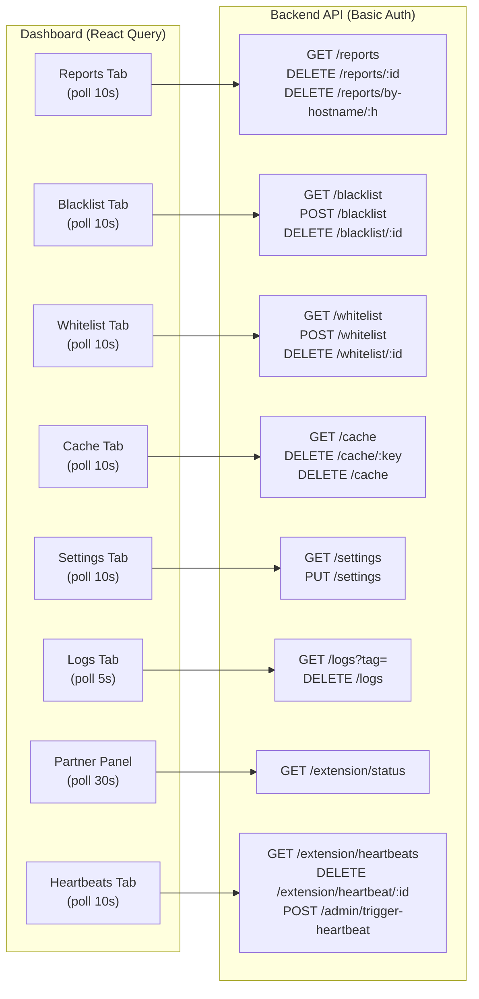

# Arsitektur Sistem

## Alur Klasifikasi URL

### Fusion Model

Skor akhir = `fusion_alpha * text_score + (1 - fusion_alpha) * image_score`

- `text_score`: Probabilitas dari *neural network* (TF-IDF → Keras) pada URL yang sudah dibersihkan
- `image_score`: Probabilitas dari *Random Forest* pada ~1500 fitur gambar (histogram warna, edge detection, warm-color ratio, grid cell variance, dll.)
- `fusion_alpha`: Bobot optimal ditemukan via *grid search* pada validation set
- **Bypass teks**: Jika `bypass_text_enabled=true` dan skor teks >= 0.95 atau <= 0.05, gambar dilewati untuk menghemat resource

### Multipage Inference

Untuk URL domain root (path kosong atau "/"), sistem melakukan crawling internal:

1. Ambil halaman root
2. Ekstrak semua link internal (domain yang sama)
3. Filter path dengan kedalaman ≤ 3, panjang ≥ 10 karakter
4. Sample hingga 8 subpath
5. Jalankan inferensi teks pada setiap subpath
6. Agregasi via **geometric mean** untuk akurasi lebih baik

## Sistem Partner Accountability

### Setup

### Password Gate & Bypass

### Reset Password

### Heartbeat & Stale Detection

## Multi-Browser Extension Guard

`isExtensionsUrl()` mendeteksi URL manajemen ekstensi:

| Browser | URL |
|---------|-----|
| Chrome | `chrome://extensions` |
| Edge | `edge://extensions` |
| Brave | `brave://extensions` |
| Opera | `opera://extensions` |
| Vivaldi | `vivaldi://extensions` |
| Firefox | `about:addons` |

Dua listener di `background.ts`:
- `tabs.onUpdated` — hanya bereaksi pada `changeInfo.url`
- `tabs.onActivated` — menangkap tab yang sudah ada saat bypass kedaluwarsa

## Grace Period

| Periode | Perilaku |
|---------|----------|
| Hari 0–7 | Grace: notifikasi "Set partner dalam X hari", akses extensions diizinkan |
| Hari 7+ | Warn: notifikasi proteksi terkompromi, akses extensions diizinkan |
| Setelah partner di-set | Block: redirect ke halaman password |

## Database SQLite (`app.db`)

| Tabel | Isi |
|-------|-----|
| `reports` | Laporan false positive (url, score, ip, timestamp) |
| `site_lists` | Blacklist & whitelist (hostname, tipe, timestamp) |
| `partner_accounts` | Partner (extension_id, email, password_hash, salt, stale_alerted_at) |
| `heartbeats` | Riwayat heartbeat (extension_id, timestamp, ip_address) |
| `tamper_logs` | Riwayat tamper (extension_id, event_type, details, timestamp) |

## Komponen Ekstensi

| Entrypoint | Fungsi |
|------------|--------|
| `background.ts` | Service worker: routing message, guard extensions, heartbeat alarm |
| `content.ts` | Content script: overlay, klasifikasi, redirect |
| `blocked/App.tsx` | Halaman blokir: skor, report false positive |
| `extensions-blocked/App.tsx` | Halaman password gate + "Forgot password?" (reset) untuk extensions page |
| `options/App.tsx` | Halaman pengaturan: setup partner, password gate dengan "Forgot password?", ganti bahasa |
| `popup/App.tsx` | Popup: status, breakdown, bypass countdown, report |

## Aliran Data Dashboard

